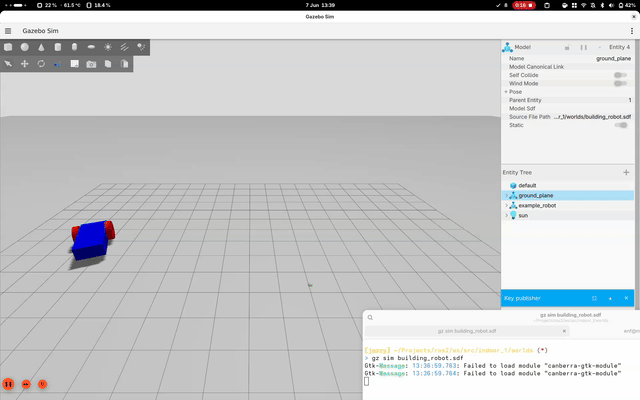
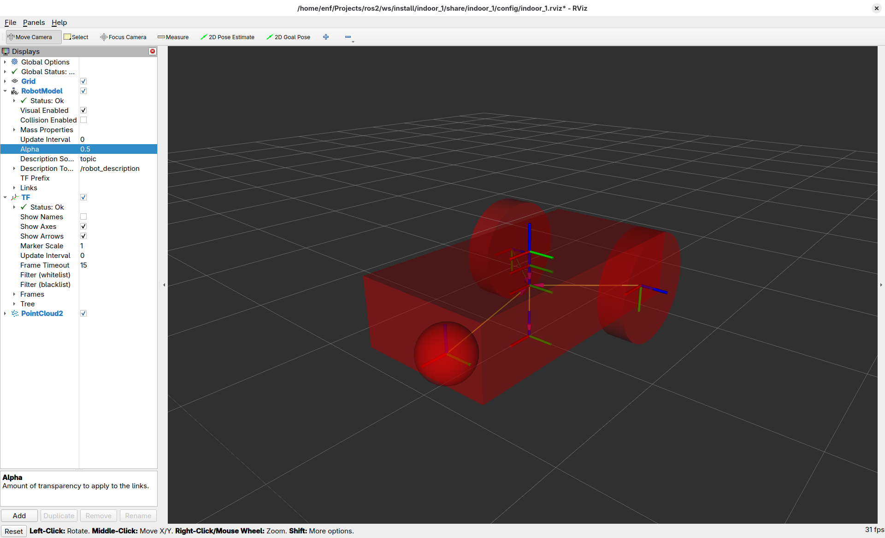

# ROS 2 Études

**Index**

- [Quick Start](#quick-start)
- [Indoor 1: LiDAR, Wheel Odometry, and IMU](#indoor-1-lidar-wheel-odometry-and-imu)


## Quick Start

> This project has been developed using [distrobox](https://distrobox.it/) and `vscode`.

**TODO** Setup Docker environment

Tracking packages:

```
apt install ros-${ROS_DISTRO}-ros-gz
apt install ros-${ROS_DISTRO}-turtlebot3-gazebo ros-${ROS_DISTRO}-navigation2 ros-${ROS_DISTRO}-nav2-bringup
```

## Gazebo Simulation

The gazebo simulation provides an empty world and a basic robot, that will be used as a canvas for the next architectural design steps



## Indoor 1: LiDAR, Wheel Odometry, and IMU

Classic 2D SLAM setup, using LiDAR and Odometry and an IMU.



To run the simulation with joystick teleop, execute:

    ros2 launch indoor_1 launch.py use_teleop:=True joy_dev:=0

Where `0` is the ID of your joystick. Check the available ones with `ls /dev/input/js*`. To try other maps use the flag `maps`.

<!--    ros2 launch indoor_1 launch.py use_teleop:=True joy_dev:=0 map:=/opt/ros/jazzy/share/nav2_minimal_tb4_sim/worlds/warehouse.sdf -->